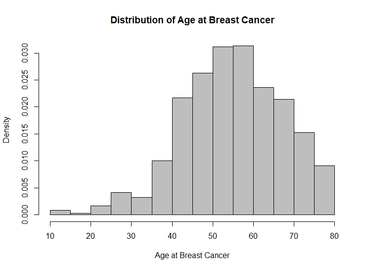
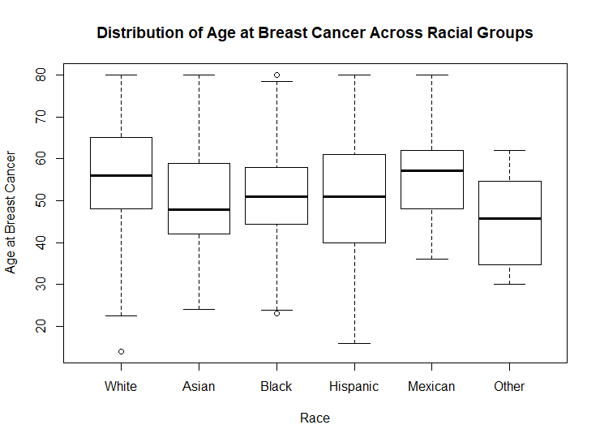
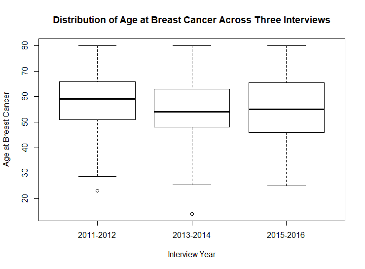

```{r setup, include = FALSE}
knitr::opts_chunk$set(echo = TRUE)
```




The histogram plot "Distribution of Age at Breast Cancer"showed that women within 50 - 60 age group have the highest risk of getting breast cancer than the other age group.



The boxplot "Distribution of Age at Breast Cancer Across Racial Groups" showed that Asian and 'Other' race group have relatively earilier breast cancer onset, while White and Mexican American have later breast cancer onset.




The boxplot "Distribution of Age at Breast Cancer Across Three Interviews" showed that the age of women getting breast cancer are similar in three interview period.