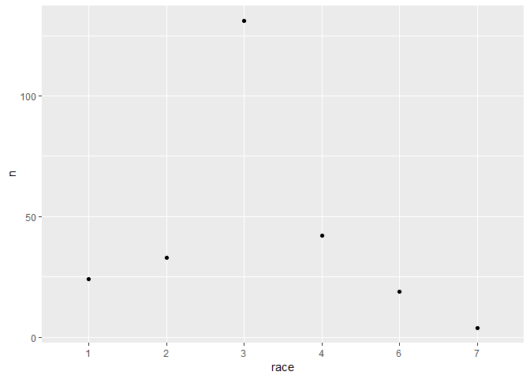
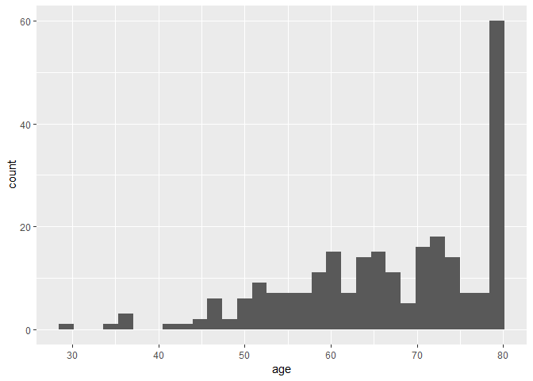
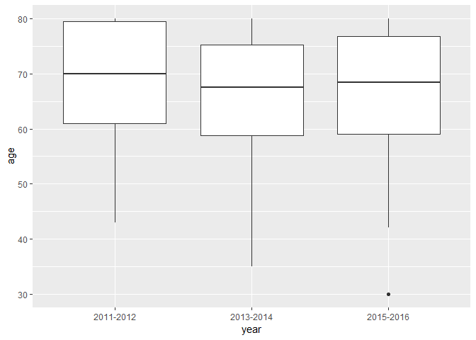

test
================
Sha Tao (st3117), Jingqi Song (js5165), Yixuan Wang (yw3095), Ditian Li (dl3157), Boya Guo (bg2604)
November 8, 2018

``` r
read_xpt_final = function(x) {
    
    read_xpt(x) %>% 
    mutate(name = x)

}


demo_file_list = list.files("./data/") %>% 
  list.filter(str_detect(., "DEMO")) %>% 
  paste0("./data/", .)

mcq_file_list = list.files("./data/") %>% 
  list.filter(str_detect(., "MCQ")) %>% 
  paste0("./data/", .)

whq_file_list = list.files("./data/") %>% 
  list.filter(str_detect(., "WHQ")) %>% 
  paste0("./data/", .)

combine_datasets = function(x) {
  
  read_xpt_output[[x]] =
    read_xpt_output[[x]] %>% 
    ifelse(str_detect(name, "DEMO") == TRUE, SELECT(SEQN, RIAGENDR, RIDAGEYR, RIDRETH3, DMDBORN4,
                                                                DMDMARTL, RIDEXPRG, WTINT2YR),
                       ifelse(str_detect(name, "WHO") == TRUE, SELECT(), 
                              SELECT(SEQN, MCQ080, MCQ220, MCQ230a, MCQ230b, MCQ240e, MCQ365a, MCQ365b, MCQ365d)))
    
  }


demo = 
  map_dfr(demo_file_list, read_xpt_final) %>% 
  select(id = SEQN, gender = RIAGENDR, age = RIDAGEYR, race = RIDRETH3, six_month = RIDEXMON, 
         birth_country = DMDBORN4, marital_status = DMDMARTL, pregancy_at_exam = RIDEXPRG, 
         two_year_weight = WTINT2YR, name) %>% 
  mutate(year = ifelse(str_detect(name, "_G") == TRUE, "2011-2012", 
                       ifelse(str_detect(name, "_H") == TRUE, "2013-2014", "2015-2016")),
         year = fct_relevel(year)) %>% 
  select(id, year, gender:two_year_weight)

#gender = fct_relevel(gender),
#race = fct_relevel(race),
#six_month = fct_relevel(six_month),
#birth_country = fct_relevel(birth_country),
#marital_status = fct_relevel(marital_status),
#pregancy_at_exam = fct_relevel(pregancy_at_exam),

mcq = 
  map_dfr(mcq_file_list, read_xpt_final) %>% 
  select(id = SEQN, overweight = MCQ080, cancer_malignancy = MCQ220, cancer_code1 = MCQ230A, 
         cancer_code2 = MCQ230B, age_breaset_cancer = MCQ240E, told_lose_weight = MCQ365A, 
         told_exercise = MCQ365B, told_reduce_fat = MCQ365D, name) %>% 
  mutate(year = ifelse(str_detect(name, "_G") == TRUE, "2011-2012", 
                       ifelse(str_detect(name, "_H") == TRUE, "2013-2014", "2015-2016")),
         year = fct_relevel(year)) %>% 
  select(id, year, overweight:told_reduce_fat)

whq = 
  map_dfr(whq_file_list, read_xpt_final) %>% 
  select(id = SEQN, self_height = WHD010, self_weight = WHD020, times_lost_ten_lb = WHQ225, 
         self_greaest_weight = WHD140, age_heaviest = WHQ150, name) %>% 
  mutate(year = ifelse(str_detect(name, "_G") == TRUE, "2011-2012", 
                       ifelse(str_detect(name, "_H") == TRUE, "2013-2014", "2015-2016")),
         year = fct_relevel(year)) %>% 
  select(id, year, self_height:age_heaviest)


nhanse = merge(demo, merge(mcq, whq)) %>% 
  replace_with_na(replace = list(birth_country = c(77, 99), marital_status = c(77, 99), overweight = c(7, 9),
                                 cancer_malignancy = c(7, 9), cancer_code1 = 99, age_breaset_cancer = 99999,
                                 told_lose_weight = c(7, 9), told_exercise = c(7, 9), told_reduce_fat = c(7, 9),
                                 self_height = c(7777, 9999), self_weight = c(7777, 9999),
                                 times_lost_ten_lb = c(7, 9), self_greaest_weight = c(7777, 9999),
                                 age_heaviest = c(77777, 99999)))
  
#replace_with_na_all(condition = ~.x == 9999)
```

``` r
nhanse %>% 
  filter(cancer_code1 == 14 | cancer_code2 == 14) %>% 
  mutate(race = as.factor(race)) %>%
  group_by(race) %>% 
  count() %>% 
  ggplot(aes(x = race, y = n)) +
    geom_point()
```



``` r
nhanse %>% 
  filter(cancer_code1 == 14 | cancer_code2 == 14) %>% 
  ggplot(aes(x = age)) +
    geom_histogram()
```

    ## `stat_bin()` using `bins = 30`. Pick better value with `binwidth`.



``` r
nhanse %>% 
  filter(cancer_code1 == 14 | cancer_code2 == 14) %>% 
  ggplot(aes(x = year, y = age)) +
    geom_boxplot()
```


