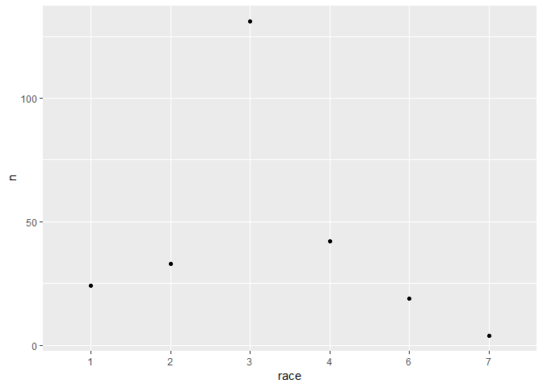
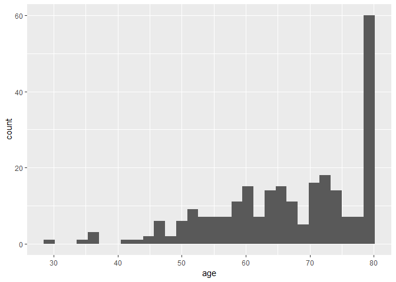
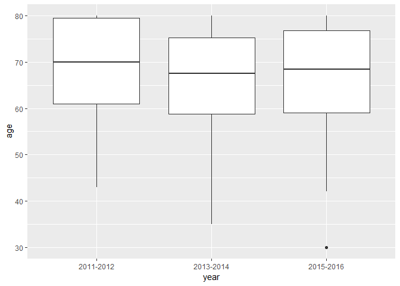

test
================
Sha Tao (st3117), Jingqi Song (js5165), Yixuan Wang (yw3095), Ditian Li (dl3157), Boya Guo (bg2604)
November 8, 2018

Load NHANES data from XPT files
-------------------------------

``` r
read_xpt_final = function(x) {
    
    read_xpt(x) %>% 
    mutate(name = x)

}


demo_file_list = list.files("./data/") %>% 
  list.filter(str_detect(., "DEMO")) %>% 
  paste0("./data/", .)

mcq_file_list = list.files("./data/") %>% 
  list.filter(str_detect(., "MCQ")) %>% 
  paste0("./data/", .)

whq_file_list = list.files("./data/") %>% 
  list.filter(str_detect(., "WHQ")) %>% 
  paste0("./data/", .)

smq_file_list = list.files("./data/") %>% 
  list.filter(str_detect(., "SMQ")) %>% 
  paste0("./data/", .)

combine_datasets = function(x) {
  
  read_xpt_output[[x]] =
    read_xpt_output[[x]] %>% 
    ifelse(str_detect(name, "DEMO") == TRUE, SELECT(SEQN, RIAGENDR, RIDAGEYR, RIDRETH3, DMDBORN4,
                                                                DMDMARTL, RIDEXPRG, SDMVPSU, SDMVSTRA, WTINT2YR),
                       ifelse(str_detect(name, "WHO") == TRUE, SELECT(), 
                              ifelse(str_detect(name, "SMQ") == TRUE, SELECT(SEQN, SMQ020),
                              SELECT(SEQN, MCQ080, MCQ220, MCQ230a, MCQ230b, MCQ240e, MCQ365a, MCQ365b, MCQ365d))))
    
}


demo = 
  map_dfr(demo_file_list, read_xpt_final) %>% 
  select(id = SEQN, gender = RIAGENDR, age = RIDAGEYR, race = RIDRETH3, six_month = RIDEXMON, 
         birth_country = DMDBORN4, marital_status = DMDMARTL, pregancy_at_exam = RIDEXPRG, strata = SDMVSTRA, 
         psu = SDMVPSU, weight = WTINT2YR, name) %>% 
  mutate(year = ifelse(str_detect(name, "_G") == TRUE, "2011-2012", 
                       ifelse(str_detect(name, "_H") == TRUE, "2013-2014", "2015-2016")),
         year = fct_relevel(year)) %>% 
  select(id, year, gender:weight)

#gender = fct_relevel(gender),
#race = fct_relevel(race),
#six_month = fct_relevel(six_month),
#birth_country = fct_relevel(birth_country),
#marital_status = fct_relevel(marital_status),
#pregancy_at_exam = fct_relevel(pregancy_at_exam),

mcq = 
  map_dfr(mcq_file_list, read_xpt_final) %>% 
  select(id = SEQN, overweight = MCQ080, cancer_malignancy = MCQ220, cancer_code1 = MCQ230A, 
         cancer_code2 = MCQ230B, age_breast_cancer = MCQ240E, told_lose_weight = MCQ365A, 
         told_exercise = MCQ365B, told_reduce_fat = MCQ365D, name) %>% 
  mutate(year = ifelse(str_detect(name, "_G") == TRUE, "2011-2012", 
                       ifelse(str_detect(name, "_H") == TRUE, "2013-2014", "2015-2016")),
         year = fct_relevel(year)) %>% 
  select(id, year, overweight:told_reduce_fat)

smq = 
  map_dfr(smq_file_list, read_xpt_final) %>% 
  select(id = SEQN, smoke_100 = SMQ020, name) %>% 
  mutate(year = ifelse(str_detect(name, "_G") == TRUE, "2011-2012", 
                       ifelse(str_detect(name, "_H") == TRUE, "2013-2014", "2015-2016")),
         year = fct_relevel(year)) %>% 
  select(id, year, smoke_100)

whq = 
  map_dfr(whq_file_list, read_xpt_final) %>% 
  select(id = SEQN, self_height = WHD010, self_weight = WHD020, times_lost_ten_lb = WHQ225, 
         self_greaest_weight = WHD140, age_heaviest = WHQ150, name) %>% 
  mutate(year = ifelse(str_detect(name, "_G") == TRUE, "2011-2012", 
                       ifelse(str_detect(name, "_H") == TRUE, "2013-2014", "2015-2016")),
         year = fct_relevel(year)) %>% 
  select(id, year, self_height:age_heaviest)
```

Clean Data
----------

``` r
nhanes = merge(demo, merge(mcq, merge(whq, smq))) %>% 
  replace_with_na(replace = list(birth_country = c(77, 99), marital_status = c(77, 99), overweight = c(7, 9),
                                 cancer_malignancy = c(7, 9), cancer_code1 = 99, age_breast_cancer = 99999,
                                 told_lose_weight = c(7, 9), told_exercise = c(7, 9), told_reduce_fat = c(7, 9),
                                 self_height = c(7777, 9999), self_weight = c(7777, 9999),
                                 times_lost_ten_lb = c(7, 9), self_greaest_weight = c(7777, 9999),
                                 age_heaviest = c(77777, 99999), smoke_100 = c(7, 9)))
  
#replace_with_na_all(condition = ~.x == 9999)


nhanes %>% 
  filter(cancer_code1 == 14 | cancer_code2 == 14) %>% 
  mutate(race = as.factor(race)) %>%
  group_by(race) %>% 
  count() %>% 
  ggplot(aes(x = race, y = n)) +
    geom_point()
```



``` r
nhanes %>% 
  filter(cancer_code1 == 14 | cancer_code2 == 14) %>% 
  ggplot(aes(x = age)) +
    geom_histogram()
```

    ## `stat_bin()` using `bins = 30`. Pick better value with `binwidth`.



``` r
nhanes %>% 
  filter(cancer_code1 == 14 | cancer_code2 == 14) %>% 
  ggplot(aes(x = year, y = age)) +
    geom_boxplot()
```



``` r
test_df = 
  nhanes %>% 
  mutate(breast_cancer = ifelse(cancer_code1 == 14 | cancer_code2 == 14, 1, 0),
         breast_cancer = ifelse(is.na(breast_cancer), 0, breast_cancer),
         breast_cancer = as.factor(breast_cancer),
         race = as.factor(race),
         race = fct_relevel(race, '3'),
         overweight = as.factor(overweight),
         overweight = fct_relevel(overweight, '2'),
         smoke_100 = fct_relevel(as.factor(smoke_100), '2')) %>% 
  filter(gender == 2) %>% 
  select(id, year, age, race, breast_cancer, overweight, smoke_100, strata, psu, weight)

test_df %>% filter(breast_cancer == 1) %>% View()
levels(test_df$smoke_100)
```

    ## [1] "2" "1"

Test logistic and survey logistic models
----------------------------------------

``` r
model1 = glm(formula = breast_cancer ~ age + race + overweight + smoke_100, family = "binomial", data = test_df)
broom::tidy(model1)
```

    ## # A tibble: 9 x 5
    ##   term        estimate std.error statistic  p.value
    ##   <chr>          <dbl>     <dbl>     <dbl>    <dbl>
    ## 1 (Intercept) -7.64      0.370    -20.6    1.61e-94
    ## 2 age          0.0685    0.00492   13.9    4.89e-44
    ## 3 race1       -0.231     0.232     -0.993  3.21e- 1
    ## 4 race2        0.00497   0.207      0.0240 9.81e- 1
    ## 5 race4       -0.390     0.186     -2.10   3.61e- 2
    ## 6 race6       -0.237     0.260     -0.911  3.62e- 1
    ## 7 race7       -0.495     0.521     -0.951  3.41e- 1
    ## 8 overweight1  0.248     0.134      1.85   6.48e- 2
    ## 9 smoke_1001   0.304     0.136      2.24   2.51e- 2

``` r
skimr::skim(test_df)
```

    ## Skim summary statistics
    ##  n obs: 9763 
    ##  n variables: 10 
    ## 
    ## -- Variable type:factor -----------------------------------------------------------------------------------------------
    ##       variable missing complete    n n_unique
    ##  breast_cancer       0     9763 9763        2
    ##     overweight       4     9759 9763        2
    ##           race       0     9763 9763        6
    ##      smoke_100     651     9112 9763        2
    ##           year       0     9763 9763        3
    ##                              top_counts ordered
    ##                  0: 9511, 1: 252, NA: 0   FALSE
    ##                 2: 6070, 1: 3689, NA: 4   FALSE
    ##      3: 3454, 4: 2240, 1: 1391, 6: 1217   FALSE
    ##               2: 6160, 1: 2952, NA: 651   FALSE
    ##  201: 3366, 201: 3277, 201: 3120, NA: 0   FALSE
    ## 
    ## -- Variable type:numeric ----------------------------------------------------------------------------------------------
    ##  variable missing complete    n     mean       sd       p0      p25
    ##       age       0     9763 9763    46.08    19.26    16       29   
    ##        id       0     9763 9763 78325.97  9202.84 62164    69872   
    ##       psu       0     9763 9763     1.53     0.55     1        1   
    ##    strata       0     9763 9763   111.27    13       90      100   
    ##    weight       0     9763 9763 38953.94 34473.1   4445.89 17232.59
    ##       p50      p75      p100     hist
    ##     45       62        80    <U+2587><U+2586><U+2586><U+2586><U+2586><U+2586><U+2585><U+2585>
    ##  78994    86193.5   93702    <U+2587><U+2587><U+2585><U+2587><U+2587><U+2587><U+2587><U+2587>
    ##      2        2         3    <U+2587><U+2581><U+2581><U+2587><U+2581><U+2581><U+2581><U+2581>
    ##    111      123       133    <U+2587><U+2586><U+2586><U+2586><U+2586><U+2586><U+2586><U+2587>
    ##  25337.61 45307.96 233755.84 <U+2587><U+2582><U+2581><U+2581><U+2581><U+2581><U+2581><U+2581>

``` r
des = svydesign(ids = ~0, strata = ~strata, data = test_df, weights = ~weight)

model2 = svyglm(breast_cancer ~ age + race + overweight + smoke_100, family = "binomial", design = des)
```

    ## Warning in eval(family$initialize): non-integer #successes in a binomial
    ## glm!

``` r
broom::tidy(model2)
```

    ## # A tibble: 9 x 5
    ##   term        estimate std.error statistic  p.value
    ##   <chr>          <dbl>     <dbl>     <dbl>    <dbl>
    ## 1 (Intercept)  -7.69     0.429    -17.9    1.28e-70
    ## 2 age           0.0702   0.00561   12.5    1.31e-35
    ## 3 race1        -0.519    0.252     -2.06   3.96e- 2
    ## 4 race2         0.0227   0.228      0.0995 9.21e- 1
    ## 5 race4        -0.350    0.202     -1.73   8.35e- 2
    ## 6 race6        -0.164    0.272     -0.605  5.45e- 1
    ## 7 race7        -0.375    0.644     -0.582  5.61e- 1
    ## 8 overweight1   0.111    0.181      0.613  5.40e- 1
    ## 9 smoke_1001    0.320    0.179      1.79   7.31e- 2
