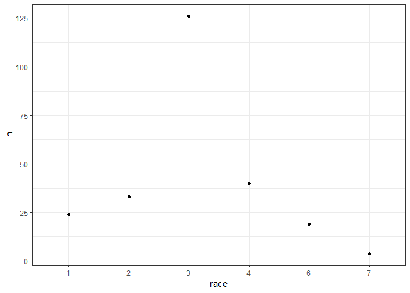
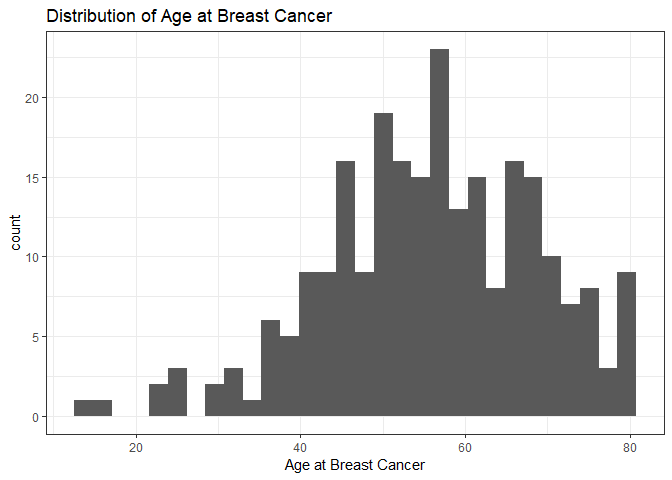
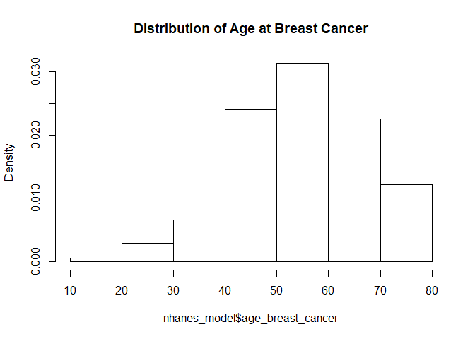
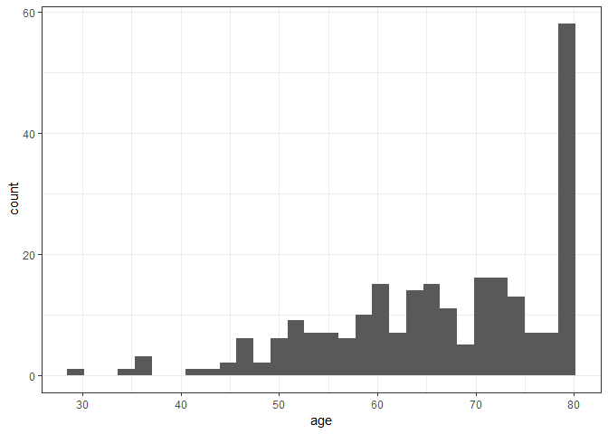
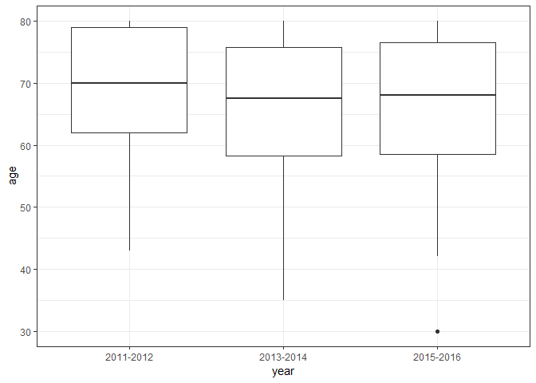

test
================
Sha Tao (st3117), Jingqi Song (js5165), Yixuan Wang (yw3095), Ditian Li (dl3157), Boya Guo (bg2604)
November 8, 2018

Load 6 years NHANES data from XPT files
---------------------------------------

``` r
files = read_csv("./data/file_link.csv")

demo = 
  files %>%  
  filter(str_detect(file_name, "DEMO")) %>% 
  mutate(map(.x = file_link, ~read_xpt(.x))) %>% 
  unnest %>% 
  select(file_name, id = SEQN, gender = RIAGENDR, age = RIDAGEYR, race = RIDRETH3, edu = DMDEDUC3, 
         six_month = RIDEXMON, birth_country = DMDBORN4, marital_status = DMDMARTL, 
         pregancy_at_exam = RIDEXPRG, strata = SDMVSTRA, psu = SDMVPSU, weight = WTINT2YR) %>% 
  mutate(year = as.factor(ifelse(str_detect(file_name, "_G") == TRUE, "2011-2012", 
                          ifelse(str_detect(file_name, "_H") == TRUE, "2013-2014", "2015-2016"))),
         weight = 1/3 * weight) %>% 
  select(id, year, gender:weight)

mcq = 
  files %>% 
  filter(str_detect(file_name, "MCQ")) %>% 
  mutate(map(.x = file_link, ~read_xpt(.x))) %>% 
  unnest %>% 
  select(file_name, id = SEQN, overweight = MCQ080, cancer_malignancy = MCQ220, cancer_code1 = MCQ230A, 
         cancer_code2 = MCQ230B, age_breast_cancer = MCQ240E, told_lose_weight = MCQ365A, 
         told_exercise = MCQ365B, told_reduce_fat = MCQ365D) %>% 
  mutate(year = as.factor(ifelse(str_detect(file_name, "_G") == TRUE, "2011-2012", 
                          ifelse(str_detect(file_name, "_H") == TRUE, "2013-2014", "2015-2016")))) %>% 
  select(id, year, overweight:told_reduce_fat)

smq = 
  files %>% 
  filter(str_detect(file_name, "SMQ")) %>% 
  mutate(map(.x = file_link, ~read_xpt(.x))) %>% 
  unnest %>% 
  select(file_name, id = SEQN, smoke_100 = SMQ020) %>% 
  mutate(year = as.factor(ifelse(str_detect(file_name, "_G") == TRUE, "2011-2012", 
                          ifelse(str_detect(file_name, "_H") == TRUE, "2013-2014", "2015-2016")))) %>% 
  select(id, year, smoke_100)

whq = 
  files %>% 
  filter(str_detect(file_name, "WHQ")) %>% 
  mutate(map(.x = file_link, ~read_xpt(.x))) %>% 
  unnest %>% 
  select(file_name, id = SEQN, self_height = WHD010, self_weight = WHD020, times_lost_ten_lb = WHQ225, 
         self_greaest_weight = WHD140, age_heaviest = WHQ150) %>% 
  mutate(year = as.factor(ifelse(str_detect(file_name, "_G") == TRUE, "2011-2012", 
                          ifelse(str_detect(file_name, "_H") == TRUE, "2013-2014", "2015-2016")))) %>% 
  select(id, year, self_height:age_heaviest)
  
alq = 
  files %>% 
  filter(str_detect(file_name, "ALQ")) %>% 
  mutate(map(.x = file_link, ~read_xpt(.x))) %>% 
  unnest %>% 
  select(file_name, id = SEQN, alcohol = ALQ130) %>% 
  mutate(year = as.factor(ifelse(str_detect(file_name, "_G") == TRUE, "2011-2012", 
                          ifelse(str_detect(file_name, "_H") == TRUE, "2013-2014", "2015-2016")))) %>% 
  select(id, year, alcohol)
  

rhq = 
  files %>% 
  filter(str_detect(file_name, "RHQ")) %>% 
  mutate(map(.x = file_link, ~read_xpt(.x))) %>% 
  unnest %>% 
  select(file_name, id = SEQN, age_first_birth = RHD180) %>% 
  mutate(year = as.factor(ifelse(str_detect(file_name, "_G") == TRUE, "2011-2012", 
                          ifelse(str_detect(file_name, "_H") == TRUE, "2013-2014", "2015-2016")))) %>% 
  select(id, year, age_first_birth)

inq = 
  files %>% 
  filter(str_detect(file_name, "INQ")) %>% 
  mutate(map(.x = file_link, ~read_xpt(.x))) %>% 
  unnest %>% 
  select(file_name, id = SEQN, income = INDFMMPC) %>% 
  mutate(year = as.factor(ifelse(str_detect(file_name, "_G") == TRUE, "2011-2012", 
                          ifelse(str_detect(file_name, "_H") == TRUE, "2013-2014", "2015-2016")))) %>% 
  select(id, year, income)
```

Clean Data
----------

``` r
# replace "refused"" and "don't know" data as missing 
nhanes = merge(demo, merge(alq, merge(inq, merge(mcq, merge(rhq, merge(smq, whq)))))) %>% 
  replace_with_na(replace = list(birth_country = c(77, 99), marital_status = c(77, 99), overweight = c(7, 9),
                                 cancer_malignancy = c(7, 9), cancer_code1 = 99, age_breast_cancer = 99999,
                                 told_lose_weight = c(7, 9), told_exercise = c(7, 9), told_reduce_fat = c(7, 9),
                                 self_height = c(7777, 9999), self_weight = c(7777, 9999),
                                 times_lost_ten_lb = c(7, 9), self_greaest_weight = c(7777, 9999),
                                 age_heaviest = c(77777, 99999), smoke_100 = c(7, 9), alcohol = c(777, 999),
                                 income = c(7, 9), age_first_birth = c(777, 999)))
# tried replace_with_na_all() function but failed

# clean and choose the predictors and exposures
nhanes_model = 
  nhanes %>% 
  mutate(breast_cancer = ifelse(cancer_code1 == 14 | cancer_code2 == 14, 1, 0),
         breast_cancer = as.factor(ifelse(is.na(breast_cancer), 0, breast_cancer)),
         race = fct_relevel(as.factor(race), '3'),
         overweight = fct_relevel(as.factor(overweight), '2'),
         smoke_100 = fct_relevel(as.factor(smoke_100), '2'),
         income = fct_relevel(as.factor(income), '2')) %>% 
  filter(gender == 2) %>% 
  select(id, year, age, race, breast_cancer, overweight, smoke_100, age_breast_cancer, alcohol, age_first_birth, 
         income, strata, psu, weight)
```

Dataset exploration
-------------------

``` r
skimr::skim(nhanes_model)
```

    ## Skim summary statistics
    ##  n obs: 8920 
    ##  n variables: 14 
    ## 
    ## -- Variable type:factor --------------------------------------------------------------
    ##       variable missing complete    n n_unique
    ##  breast_cancer       0     8920 8920        2
    ##         income     565     8355 8920        3
    ##     overweight       4     8916 8920        2
    ##           race       0     8920 8920        6
    ##      smoke_100     152     8768 8920        2
    ##           year       0     8920 8920        3
    ##                              top_counts ordered
    ##                  0: 8674, 1: 246, NA: 0   FALSE
    ##      3: 3890, 1: 3306, 2: 1159, NA: 565   FALSE
    ##                 2: 5445, 1: 3471, NA: 4   FALSE
    ##      3: 3205, 4: 2068, 1: 1247, 6: 1093   FALSE
    ##               2: 5919, 1: 2849, NA: 152   FALSE
    ##  201: 3101, 201: 2976, 201: 2843, NA: 0   FALSE
    ## 
    ## -- Variable type:numeric -------------------------------------------------------------
    ##           variable missing complete    n     mean       sd       p0
    ##                age       0     8920 8920    47.56    18.38    18   
    ##  age_breast_cancer    8676      244 8920    55.86    12.97    14   
    ##    age_first_birth    3885     5035 8920    22.2      4.93    14   
    ##            alcohol    4118     4802 8920     2.14     1.79     1   
    ##                 id       0     8920 8920 78315.31  9172.62 62164   
    ##                psu       0     8920 8920     1.53     0.55     1   
    ##             strata       0     8920 8920   111.26    12.94    90   
    ##             weight       0     8920 8920 13269.13 11657.91  1776.99
    ##       p25      p50      p75     p100     hist
    ##     32       47       62       80    <U+2587><U+2587><U+2587><U+2587><U+2586><U+2587><U+2586><U+2586>
    ##     47.75    56       65       80    <U+2581><U+2581><U+2582><U+2586><U+2587><U+2587><U+2586><U+2583>
    ##     19       21       25       43    <U+2583><U+2587><U+2583><U+2583><U+2582><U+2581><U+2581><U+2581>
    ##      1        2        3       30    <U+2587><U+2581><U+2581><U+2581><U+2581><U+2581><U+2581><U+2581>
    ##  69930.75 78955.5  86133    93702    <U+2587><U+2587><U+2585><U+2587><U+2587><U+2587><U+2587><U+2587>
    ##      1        2        2        3    <U+2587><U+2581><U+2581><U+2587><U+2581><U+2581><U+2581><U+2581>
    ##    100      111      123      133    <U+2587><U+2586><U+2586><U+2586><U+2586><U+2586><U+2586><U+2587>
    ##   5913.93  8639.98 15472.36 77918.61 <U+2587><U+2582><U+2581><U+2581><U+2581><U+2581><U+2581><U+2581>

Survey Data Design
------------------

``` r
# Make Survey Design
design = svydesign(id = ~psu, strata = ~strata, data = nhanes_model, weights = ~weight, nest = TRUE)
```

Test logistic and survey logistic models
----------------------------------------

``` r
# proposed model 1, smoking as main effectr
model1 = svyglm(breast_cancer ~ age + race + smoke_100, family = "binomial", design = design)
broom::tidy(model1)
```

    ## # A tibble: 8 x 5
    ##   term        estimate std.error statistic  p.value
    ##   <chr>          <dbl>     <dbl>     <dbl>    <dbl>
    ## 1 (Intercept)  -7.70     0.369     -20.8   4.31e-23
    ## 2 age           0.0709   0.00504    14.1   4.64e-17
    ## 3 race1        -0.473    0.243      -1.95  5.85e- 2
    ## 4 race2         0.0917   0.224       0.410 6.84e- 1
    ## 5 race4        -0.334    0.191      -1.75  8.79e- 2
    ## 6 race6        -0.125    0.301      -0.415 6.81e- 1
    ## 7 race7        -0.332    0.637      -0.521 6.05e- 1
    ## 8 smoke_1001    0.358    0.200       1.79  8.11e- 2

``` r
# null model 2, include only age and race 
model2 = svyglm(breast_cancer ~ age + race, family = "binomial", design = design)

# full model 3, include all the variables mentioned in the reference
model3 = svyglm(breast_cancer ~ age + race + smoke_100 + overweight + alcohol + age_first_birth + income, family = "binomial", design = design)

# comparison of AIC between 3 models
tibble(
  model = c("model1", "model2", "model3"),
  AIC = c(summary(model1)$aic, summary(model2)$aic, summary(model3)$aic)) %>% 
  knitr::kable(digit = 3)
```

| model  |       AIC|
|:-------|---------:|
| model1 |  1850.594|
| model2 |  1853.784|
| model3 |   833.398|

``` r
# comparison between model 1 and model 3
anova(model1, model3, method = "Wald")
```

    ## Wald test for overweight alcohol age_first_birth income
    ##  in svyglm(formula = breast_cancer ~ age + race + smoke_100 + overweight + 
    ##     alcohol + age_first_birth + income, family = "binomial", 
    ##     design = design)
    ## F =  1.073669  on  5  and  35  df: p= 0.39167

``` r
nhanes %>% 
  filter(cancer_code1 == 14 | cancer_code2 == 14) %>% 
  mutate(race = as.factor(race)) %>%
  group_by(race) %>% 
  count() %>% 
  ggplot(aes(x = race, y = n)) +
    geom_point()
```



``` r
nhanes_model %>% 
  ggplot(aes(x = age_breast_cancer)) + 
    geom_histogram() +
    labs(
    title = "Distribution of Age at Breast Cancer",
    x = "Age at Breast Cancer"
    )
```

    ## `stat_bin()` using `bins = 30`. Pick better value with `binwidth`.

    ## Warning: Removed 8676 rows containing non-finite values (stat_bin).



``` r
svyhist(~nhanes_model$age_breast_cancer, breaks = , design, main = "Distribution of Age at Breast Cancer")
```



``` r
nhanes %>% 
  filter(cancer_code1 == 14 | cancer_code2 == 14) %>% 
  ggplot(aes(x = age)) +
    geom_histogram()
```

    ## `stat_bin()` using `bins = 30`. Pick better value with `binwidth`.



``` r
nhanes %>% 
  filter(cancer_code1 == 14 | cancer_code2 == 14) %>% 
  ggplot(aes(x = year, y = age)) +
    geom_boxplot()
```


